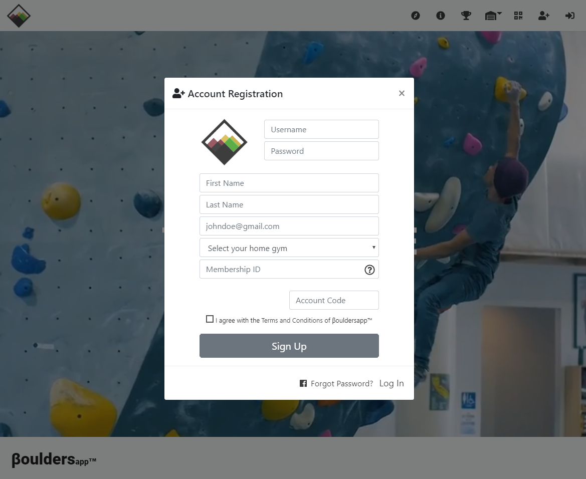
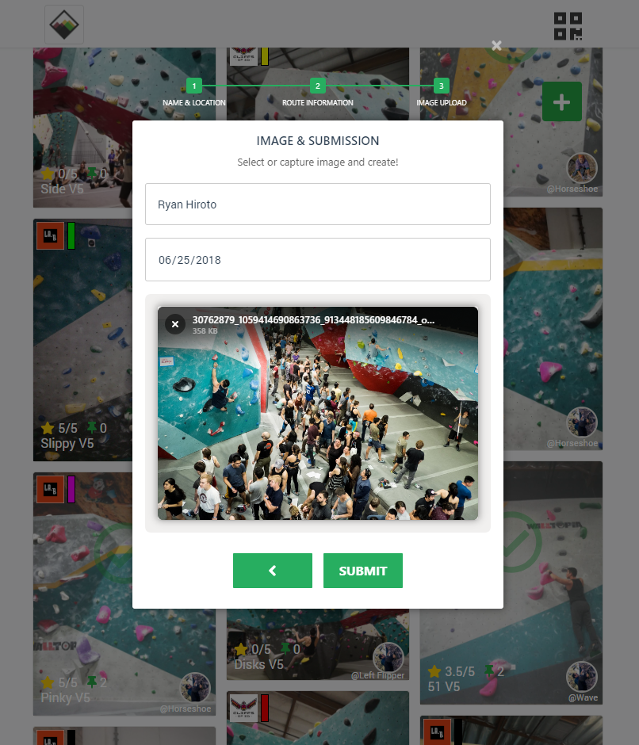
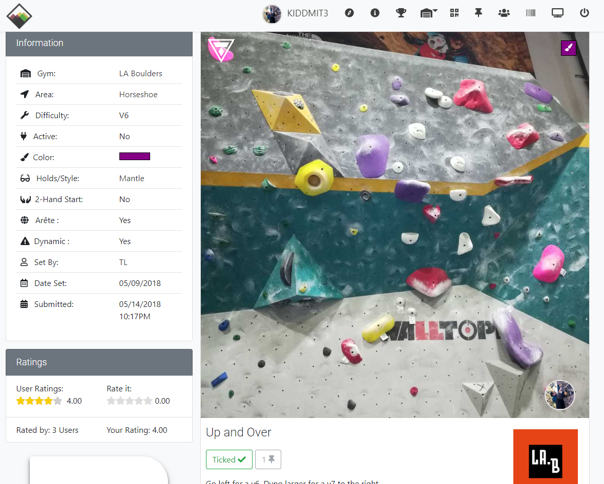
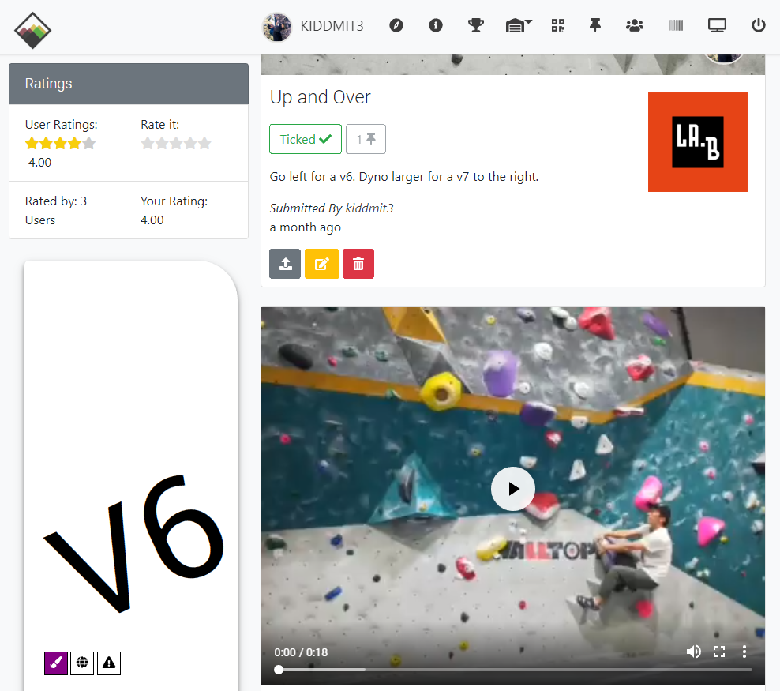
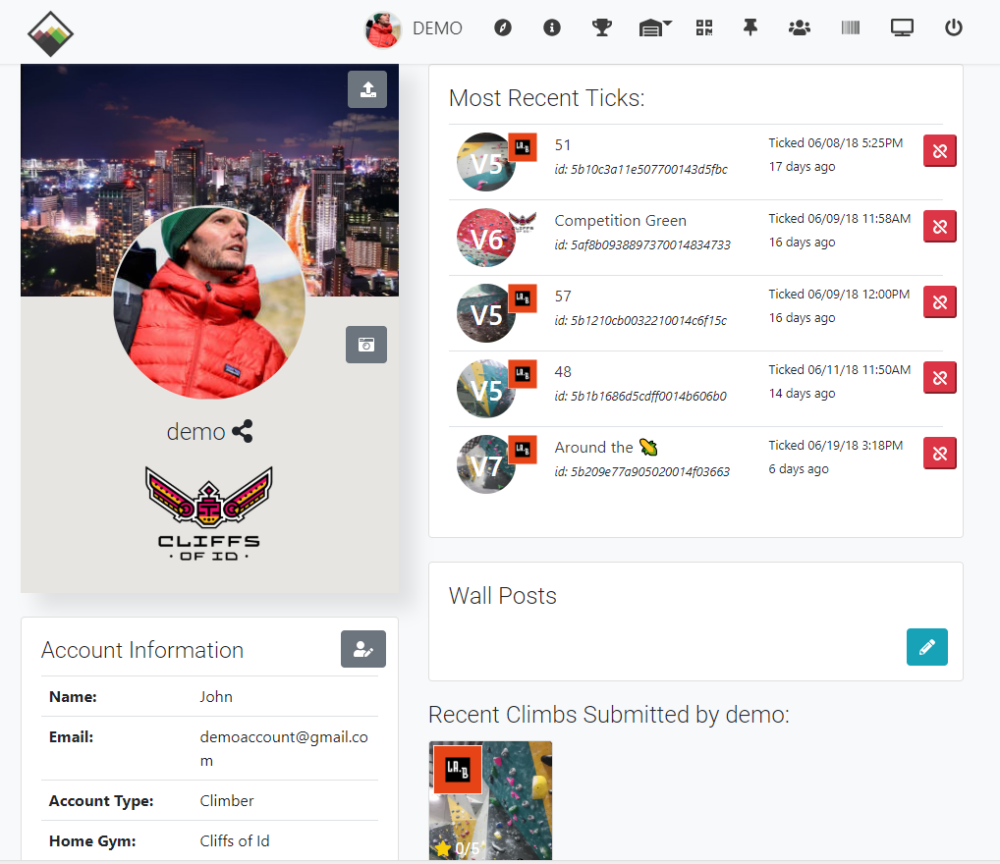
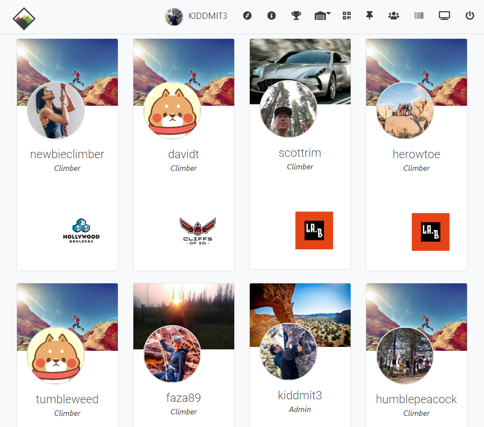
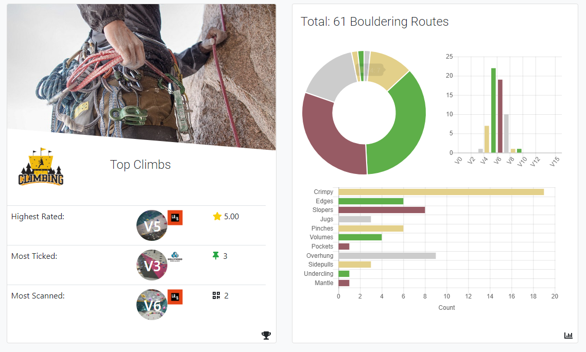
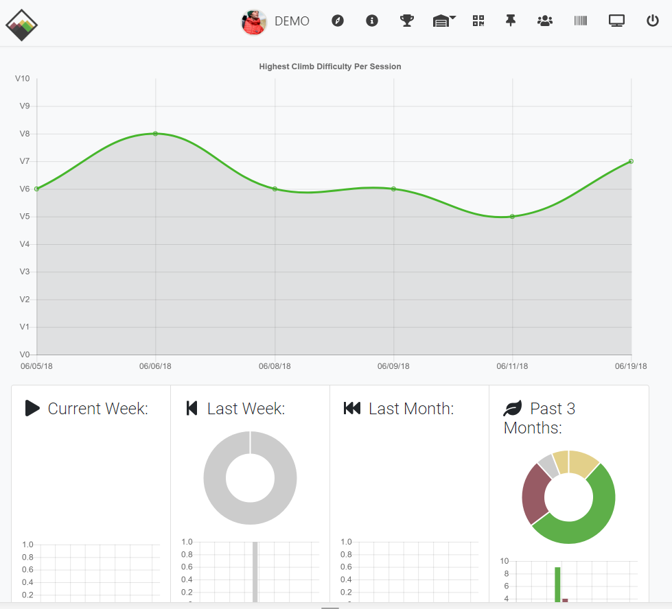

# BetaBouldersApp

A fully featured progressive web app (PWA) for indoor rock climbing gyms. Aimed towards gyms that want to engage with their members, advertise their climbs, and gain meaningful feedback. 

Gyms can use this application to print unique route tags containing qr codes. At location, users can scan and access important route information including uploaded images and solutions videos. 

Create an account, add climbs to the database, mark off the ones you've done (can be done also by scanning), and rate climbs through a star rating system. 

## Demo
[betabouldersapp.com](https://betabouldersapp.com)

Sign up for an account and Log in

Create a climb by uploading an image (browser level compressed) and inserting a few key details.

View information on individual climbs, rate 1-5 stars, or leave a comment. As the author of the climb, you can upload a video to share beta (the solution).

Edit your user profile and add climbs you completed by either scanning in person or in app. Browse other climbers profiles in the database.

View important stats on your progress and see distribution of climbs at your gym.

## Made with mobile use in mind
 

## Built With

* [Mongoose](https://github.com/Automattic/mongoose)
* [Express](https://github.com/expressjs) - Web Framework used
* [Bootstrap 4](https://getbootstrap.com/) - Frontend Stylings for mobile responsiveness
* [Node.js](https://github.com/nodejs/node) - For add-ons including Cloudinary
* Datatables.js
* chart.js
* nodemailer
* ejs
* jQuery
* mathjs
* underscore.js

## Authors

* **David Lac** - [kiddmit3](https://github.com/kiddmit3)

## Features
1. User Athentication and Authorization
2. Cloud image/video upload and storage for climbs
3. Admin accounts that can edit or delete any climbs and comments
4. Password reset with automated email token
5. Editable User profile pages
6. Image/Video Upload compression and optimization
7. Integrated membership ids as barcodes for checking in
8. QR Codes for each climbing page
9. Climb Route Tag Generator
10. In app continuous scan QR Code Reader
11. Star ratings system
12. Search and filter climbs by location, type, and grade
13. Competition mode

## Future Features
1. Machine Learning (Deep Learning) for suggested routes after you ticked
2. Image Annotations for beta hints
3. Photogrammetry for wall sections

&copy; 2018 BetaBouldersApp

